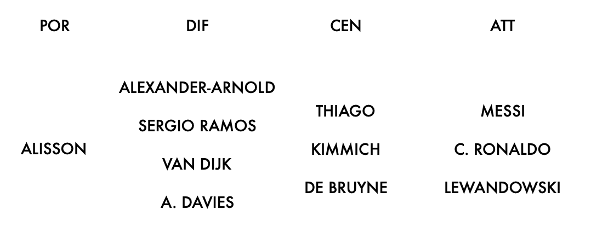

```{r setup, include=FALSE}
knitr::opts_chunk$set(echo = FALSE)
library(dplyr)
library(tidyr)
library(readr)
library(ggplot2)
library(reactable)
```
# Introduzione 

## Introduzione

<b>FIFA</b> è una serie di videogiochi di calcio sviluppata e pubblicata annualmente dalla nota società Electronic Arts.<br> 
Ogni anno <b>più di 18 mila giocatori</b> sono presenti nel gioco, <b>ognuno con più di 100 attributi</b> che lo caratterizzano.

Le statistiche in gioco dei giocatori vengono assegnate in base alle loro prestazioni reali, motivo per cui ogni anno variano.

Ma c'è effettivamente una <b>correlazione tra vita reale e gioco</b>? 

# Obiettivi

## Obiettivi

- I giovani giocatori di FIFA 15 con maggior potenziale in gioco lo hanno raggiunto in FIFA 21?
- Che rapporto c'è tra overall dei giocatori e i ranking di FIFA e UEFA?
- Se una società volesse acquistare un giocatore, potrebbe far fede ai parametri di FIFA?
- I giocatori più forti del gioco sono anche i migliori al mondo?

# Analisi

# Potenziale dei giocatori

## Potenziale dei giocatori

```{r}

players21 = read.csv("players_21.csv")
players15 = read.csv("players_15.csv")
players15 = players15[order(-players15$potential),]
players15 = filter(players15, age<=25)
players15 = players15 %>% select(short_name, long_name,
                     age,
                     club_name,
                     overall,
                     potential,
                     value_eur,
                     wage_eur) %>%
             slice(1:6)

list <- c()
for(i in 1:nrow(players15)){
  list <- append(list, players15[i,2])
}
target <- list

tmpDF15 = players15 %>% select(short_name, potential)

tmpDF15[3,1] = "Neymar Jr"

names(tmpDF15)[2] = "rating"

for(i in 1:nrow(tmpDF15)){
  tmpDF15[i,3] = "Potential 15"
}

names(tmpDF15)[3] = "type"

tmpDF21 = players21 %>% filter(players21$long_name %in% target) %>%
                                                 select(short_name,
                                                        overall)

names(tmpDF21)[2] = "rating"

for(i in 1:nrow(tmpDF21)){
  tmpDF21[i,3] = "Overall 21"
}

names(tmpDF21)[3] = "type"

potentialDF = merge(tmpDF21, tmpDF15, all=TRUE)

ggplot(potentialDF, aes(fill=type, x=short_name, y=rating)) +
  geom_bar(position="dodge", stat="identity", width = 0.7) +
  ggtitle("I giocatori hanno raggiunto il loro potenziale?") +
  labs(x = "Giocatore", y = "Rating", fill = "Valore") +
  geom_text(aes(label=rating), position=position_dodge(width=0.9), vjust=-0.25, size=5) +
  theme_classic() +
  theme(text = element_text(size=12), plot.title = element_text(hjust = 0.5))


```

# Ranking e overall

## Ranking FIFA

Secondo il ranking della FIFA, le nazionali più forti al mondo sono le seguenti:
<b>Belgio</b> (1), <b>Francia</b> (2), <b>Brasile</b> (3), <b>Inghilterra</b> (4), <b>Portogallo</b> (5).

## Ranking FIFA

```{r}

DFmedia = players21 %>% select(nationality, overall)
DFmedia = DFmedia %>% filter(DFmedia$nationality %in% c("Belgium", "France", "Brazil", "England", "Portugal"))
ggplot(data = DFmedia) +
  geom_boxplot(mapping = aes(x = reorder(nationality, overall, FUN = mean), 
                             y = overall,
                             fill=factor(as.factor(nationality)))) +
  scale_fill_manual(values = c("#e60000","#e6e600","#ffffff","#8080ff", "#006600")) +
  labs(x = "Nazione", y = "Media overall") +
  ggtitle("Media overall delle top 5 nazionali") +
  theme(plot.title = element_text(hjust = 0.5), legend.title = element_blank())

```

## Ranking UEFA per club

Secondo il ranking della UEFA, le società più forti d'Europa sono le seguenti:
<b>FC Bayern München</b> (1), <b>Real Madrid</b> (2), <b>Manchester City</b> (3), <b>FC Barcelona</b> (4), <b>Juventus</b> (5).

## Ranking UEFA per club

```{r}

DFmediaC = players21 %>% select(club_name, overall)
DFmediaC = DFmediaC %>% filter(DFmediaC$club_name %in% c("FC Bayern München", "Real Madrid", "Manchester City", "FC Barcelona", "Juventus"))
ggplot(data = DFmediaC) +
  geom_boxplot(mapping = aes(x = reorder(club_name, overall, FUN = mean), 
                             y = overall,
                             fill=factor(as.factor(club_name)))) +
  labs(x = "Club", y = "Media overall") +
  scale_fill_manual(values = c("#e6e600","#e60000","#ffffff","#8080ff", "#ffb3bf")) +
  ggtitle("Media overall dei top 5 club") +
  theme(plot.title = element_text(hjust = 0.5), legend.title = element_blank())

```

## Ranking UEFA per campionati

Secondo il ranking della UEFA, i campionati migliori d'Europa sono i seguenti:
<b>Premier League</b> (ENG) (1), <b>LaLiga</b> (ESP) (2), <b>Serie A</b> (ITA) (3), <b>Bundesliga</b> (GER) (4), <b>Ligue 1</b> (FRA) (5).

## Ranking UEFA per campionati

```{r}

DFmediaN = players21 %>% select(league_name, overall)
DFmediaN = DFmediaN %>% filter(DFmediaN$league_name %in% c("English Premier League", "Spain Primera Division", "Italian Serie A", "German 1. Bundesliga", "French Ligue 1"))
ggplot(data = DFmediaN) +
  geom_boxplot(mapping = aes(x = reorder(league_name, overall, FUN = mean), 
                             y = overall,
                             fill=factor(as.factor(league_name)))) +
  labs(x = "Campionato", y = "Media overall") +
  scale_fill_manual(values = c("#ffffff", "#e6e600","#e60000","#8080ff", "#ffa500")) +
  ggtitle("Media overall dei top 5 campionati") +
  theme(plot.title = element_text(hjust = 0.5), legend.title = element_blank(), axis.text.x=element_blank(),
        axis.ticks.x=element_blank())

```

# Ricerca dell'attaccante ideale

## Ricerca dell'attaccante ideale

Se la nostra squadra fosse alla ricerca dell'attaccante perfetto da inserire nella propria rosa, potrebbe far fede ai parametri di FIFA per trovarlo?

In particolare, le caratteristiche principali di questo giocatore devono essere: ottima finalizzazione, ottima freddezza, buona velocità, buon dribbling. 

È importante, poi, investire su calciatori giovani e che non abbiano più di due anni di contratto.

## Ricerca dell'attaccante ideale

```{r}

DFatt = players21
DFatt = DFatt %>% filter(DFatt$attacking_finishing >= 85 &
                           DFatt$mentality_composure >= 80 &
                           DFatt$movement_sprint_speed >= 75 &
                           DFatt$movement_acceleration >= 75 &
                           DFatt$movement_agility >= 70
                           )
DFatt = DFatt %>% filter(grepl("ST", DFatt$player_positions, fixed = TRUE))

DFatt = DFatt %>% filter(DFatt$age <= 27 &
                           DFatt$contract_valid_until <= 2023)
DFatt1 = DFatt %>% select(short_name,
                         attacking_finishing,
                         attacking_heading_accuracy,
                         skill_dribbling,
                         skill_ball_control,
                         movement_sprint_speed,
                         movement_acceleration,
                         movement_agility,
                         movement_balance,
                         power_strength,
                         mentality_positioning,
                         mentality_composure,
                         )

DFattplot = data.frame("Name" = NA, "Attribute" = NA, "Value" = NA)

for(i in 1:12){
  if(i>1){
    DFattplot[i-1,1] = "K. Mbappé"
    DFattplot[i-1,2] = names(DFatt1)[i]
    DFattplot[i-1,3] = DFatt1[1,i]
  }
}

for(i in 1:12){
  if(i>1){
    DFattplot[i+11,1] = "L. Martínez"
    DFattplot[i+11,2] = names(DFatt1)[i]
    DFattplot[i+11,3] = DFatt1[2,i]
  }
}

for(i in 1:12){
  if(i>1){
    DFattplot[i+22,1] = "Gabriel Jesus"
    DFattplot[i+22,2] = names(DFatt1)[i]
    DFattplot[i+22,3] = DFatt1[3,i]
  }
}

DFattplot = DFattplot %>% drop_na()

ggplot(data=DFattplot, aes(x=Attribute, y=Value, group=Name)) +
  geom_line(aes(color=Name))+
  geom_point(aes(color=Name))+
  theme(axis.text.x = element_text(angle = 60, hjust = 1)) +
  ggtitle("Migliori attaccanti sotto i 27 anni e con meno di 2 anni di contratto") +
  labs(x = "Attributo", y = "Valore", color = "Giocatore")
                    

```

## Ricerca dell'attaccante ideale

```{r}

DFatt2 = DFatt %>% select(short_name,
                         age,
                         club_name,
                         value_eur
                         )

reactable(
  DFatt2,
  defaultColDef = colDef(
    header = function(value) gsub(".", " ", value, fixed = TRUE),
    cell = function(value) format(value, nsmall = 1),
    align = "center",
    minWidth = 150,
    headerStyle = list(background = "#f7f7f8")
  ),
  columns = list(
    short_name = colDef(name = "Nome"),
    age = colDef(name = "Età"),
    club_name = colDef(name = "Club"),
    value_eur = colDef(name = "Valore di mercato", defaultSortOrder = "desc")
  ),
  bordered = TRUE,
  highlight = TRUE,
  resizable = TRUE,
  wrap = FALSE
)
                    

```

# Analisi dei migliori giocatori

## FIFA FIFPro World XI 2020

{width=99%}

## Metodo di calcolo

Il rating dei giocatori viene calcolato esclusivamente attraverso i valori degli
attributi specifici dei vari ruoli.

Vengono scelti un portiere, 4 difensori, 3 centrocampisti e 3 attaccanti.

## Miglior portiere 

```{r}

GK = players21
GK = GK%>%filter(grepl("GK", GK$player_positions, fixed = TRUE))
GK = GK %>% select(short_name,
                         gk_diving,
                         gk_handling,
                         gk_kicking,
                         gk_reflexes, 
                         gk_speed,
                         gk_positioning
                         )

for(i in 1:nrow(GK)){
  valore = 0;
  valore = (GK[i,2]*2) + (GK[i,3]*1) + (GK[i,4]*0.5) + (GK[i,5]*2) + (GK[i,6]*0.5) + (GK[i,7]*2)
  GK[i,8] = valore
}

names(GK)[8] = "rating"

GK = GK[order(-GK$rating),]

GK = GK%>%slice(1:3)

ggplot(GK, aes(x=reorder(short_name, rating), y=rating)) +
  geom_bar(position="dodge", stat="identity", width = 0.5, fill="white", colour="dodgerblue") +
  ggtitle("Chi è il miglior portiere di FIFA 21?") +
  labs(x = "Giocatore", y = "Rating") +
  geom_text(aes(label=rating), position=position_dodge(width=0.9), vjust=-0.25, size=5) +
  theme_classic() +
  theme(text = element_text(size=12), plot.title = element_text(hjust = 0.5))


```

## Migliori difensori 

```{r}

DIF = players21
DIF = DIF %>% select(short_name,
                         movement_sprint_speed,
                         mentality_interceptions,
                         defending_standing_tackle,
                         defending_sliding_tackle, 
                         mentality_composure,
                         power_strength
                         )

for(i in 1:nrow(DIF)){
  valore = 0;
  valore = (DIF[i,2]*1) + (DIF[i,3]*2) + (DIF[i,4]*2) + (DIF[i,5]*2) + (DIF[i,6]*1) + (DIF[i,7]*1)
  DIF[i,8] = valore
}

names(DIF)[8] = "rating"

DIF = DIF[order(-DIF$rating),]

DIF = DIF%>%slice(1:6)

ggplot(DIF, aes(x=reorder(short_name, rating), y=rating)) +
  geom_bar(position="dodge", stat="identity", width = 0.5, fill="dodgerblue", colour="dodgerblue") +
  ggtitle("Chi sono i migliori difensori di FIFA 21?") +
  labs(x = "Giocatore", y = "Rating") +
  geom_text(aes(label=rating), position=position_dodge(width=0.9), vjust=-0.25, size=5) +
  theme_classic() +
  theme(text = element_text(size=12), plot.title = element_text(hjust = 0.5))

```

## Migliori centrocampisti 

```{r}

CEN = players21
CEN = CEN %>% select(short_name,
                         mentality_vision,
                         attacking_short_passing,
                         skill_dribbling,
                         skill_long_passing, 
                         skill_ball_control,
                         mentality_aggression,
                         power_stamina
                         )

for(i in 1:nrow(CEN)){
  valore = 0;
  valore = (CEN[i,2]*1) + (CEN[i,3]*2) + (CEN[i,4]*1) + (CEN[i,5]*3) + (CEN[i,6]*1) + (CEN[i,7]*2) + + (CEN[i,8]*4)
  CEN[i,9] = valore
}

names(CEN)[9] = "rating"

CEN = CEN[order(-CEN$rating),]

CEN = CEN%>%slice(1:5)

ggplot(CEN, aes(x=reorder(short_name, rating), y=rating)) +
  geom_bar(position="dodge", stat="identity", width = 0.5, fill="red") +
  ggtitle("Chi sono i migliori centrocampisti di FIFA 21?") +
  labs(x = "Giocatore", y = "Rating") +
  geom_text(aes(label=rating), position=position_dodge(width=0.9), vjust=-0.25, size=5) +
  theme_classic() +
  theme(text = element_text(size=12), plot.title = element_text(hjust = 0.5))

```

## Migliori attaccanti 

```{r}

ATT = players21
ATT = ATT %>% select(short_name,
                         attacking_finishing,
                         skill_dribbling,
                         movement_sprint_speed,
                         power_shot_power, 
                         mentality_composure,
                         mentality_positioning
                         )

for(i in 1:nrow(ATT)){
  valore = 0;
  valore = (ATT[i,2]*3) + (ATT[i,3]*1) + (ATT[i,4]*1) + (ATT[i,5]*1) + (ATT[i,6]*2) + (ATT[i,7]*2)
  ATT[i,8] = valore
}

names(ATT)[8] = "rating"

ATT = ATT[order(-ATT$rating),]

ATT = ATT%>%slice(1:5)

ggplot(ATT, aes(x=reorder(short_name, rating), y=rating)) +
  geom_bar(position="dodge", stat="identity", width = 0.5, fill="black") +
  ggtitle("Chi sono i migliori attaccanti di FIFA 21?") +
  labs(x = "Giocatore", y = "Rating") +
  geom_text(aes(label=rating), position=position_dodge(width=0.9), vjust=-0.25, size=5) +
  theme_classic() +
  theme(text = element_text(size=12), plot.title = element_text(hjust = 0.5))

```

## Top 11 di FIFA 21

{width=99%}

# Conclusioni

