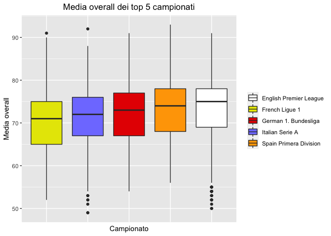
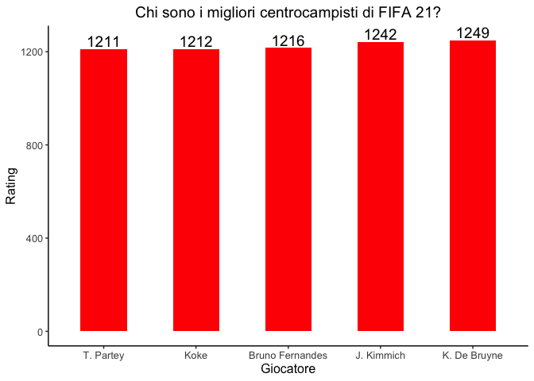
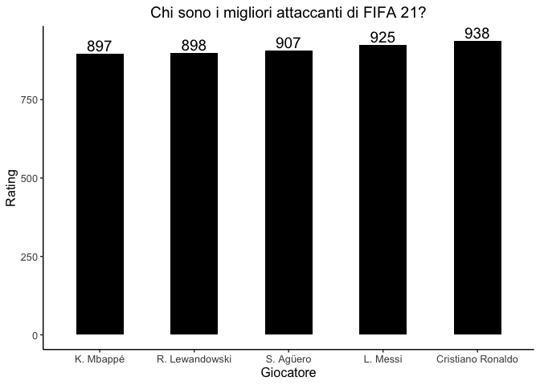

Data Science in FIFA
================
Davide Russolo

## Introduzione

FIFA è una serie di videogiochi di calcio sviluppata e pubblicata
annualmente dalla nota società Electronic Arts. Ogni anno più di 18 mila
giocatori sono presenti nel gioco, ognuno con più di 100 attributi che
lo caratterizzano.

Le statistiche in gioco dei giocatori vengono assegnate in base alle
loro prestazioni reali, motivo per cui ogni anno variano.

In particolare, il gioco assegna ad ogni calciatore un valore, chiamato
overall, che varia a seconda delle sue abilità.

Ma c’è effettivamente una correlazione tra vita reale e gioco?

## Obiettivi

Per andare ad analizzare se ci sia o meno correlazione tra gioco e ciò
che avviene nella “vita reale” vengono prefissati i seguenti obiettivi:

-   I giovani giocatori di FIFA 15 con maggior potenziale in gioco lo
    hanno raggiunto in FIFA 21? Per analizzare se coloro che in FIFA 15
    venivano definiti “i talenti del futuro” hanno raggiunto il
    potenziale, ovvero le loro prestazioni reali nel corso degli anni
    sono state quelle che la celebre casa di videogiochi si aspettava.

-   Che rapporto c’è tra overall dei giocatori e i ranking di FIFA e
    UEFA? FIFA (Fédération Internationale de Football Association) e
    UEFA aggiornano costantemente i loro ranking, ovvero attribuiscono a
    ogni nazionale/club/campionato un punteggio basato sulle prestazioni
    durante l’ultimo anno, creando delle gerarchie all’interno del mondo
    calcistico. Dall’altra parte, all’interno di FIFA viene assegnato ad
    ogni singolo giocatore un overall. La media degli overall dei top 5
    nazionali/club/campionati rispetta realmente ciò che viene stabilito
    da FIFA e UEFA?

-   Se una società volesse acquistare un giocatore, potrebbe far fede ai
    parametri di FIFA? Se volessimo cercare un giocatore da acquistare
    nella vita reale, per esempio un attaccante, il gioco potrebbe
    aiutarci nella nostra ricerca trovando il profilo che si adatta
    meglio a ciò che cerchiamo oppure no? È importante fornire delle
    basi sulle quali basare la ricerca, che vedremo in modo più
    approfondito successivamente.

-   I giocatori più forti del gioco sono anche i migliori al mondo? Ogni
    anno la FIFA assegna un riconoscimento, il FIFA FIFPro World XI,
    agli 11 migliori giocatori della stagione appena conclusa. I
    giocatori che hanno ricevuto questo premio nel 2020 sono anche i
    migliori giocatori per il loro ruolo in FIFA 21? Per questa ricerca
    viene assegnato un punteggio ad ogni giocatore basato sulle
    statistiche in gioco fondamentali per il ruolo che svolgono.

## Dataset

I dataset utilizzati per l’analisi provengono dal sito “Kaggle” e
contengono i dati di tutti i giocatori presenti in FIFA 15, necessari
per il raggiungimento del primo obiettivo posto e di FIFA 21.

Per ogni obiettivo diverso il data frame utilizzato verrà “pulito” dai
dati non utili all’analisi, in modo da rendere la ricerca più veloce e
diminuire i tempi di compilazione.

## Potenziale dei giocatori

Per essere considerato un “talento del futuro”, un giocatore deve avere
meno di 25 anni e un ottimo potenziale.

<!-- --> Si può
notare come l’unico giocatore ad aver raggiunto le aspettative sia stato
**Neymar Jr**, attualmente in forza al Paris Saint Germain. **Courtois**
e **Hazard** ci sono andati vicino, entrambi sono infatti reduci da
numerose stagione ad alti livelli che sono valse per entrambi la
chiamata del Real Madrid.

Troviamo poi invece **Bale** e **James Rodriguez** che hanno invece
deluso nel corso degli ultimi anni, fino ad arrivare a **Götze**, non
presente nel dataset poiché addirittura svincolato a inizio della
stagione corrente.

## Ranking FIFA

Secondo il ranking della FIFA, le nazionali più forti al mondo sono le
seguenti: Belgio (1), Francia (2), Brasile (3), Inghilterra (4),
Portogallo (5).

La media degli overall dei giocatori provenienti dalle nazioni sopra
citate rispetterà la classifica stilata dal più grande organo del mondo
calcistico internazionale?

<!-- -->

Come possiamo vedere l’ordine è differente da quello del ranking FIFA.

## Ranking UEFA per club

Secondo il ranking della UEFA, le società più forti d’Europa sono le
seguenti: FC Bayern München (1), Real Madrid (2), Manchester City (3),
FC Barcelona (4), Juventus (5).

La media degli overall dei giocatori provenienti dai club sopra citati
rispetterà la classifica stilata dalla UEFA?

<!-- -->

Come possiamo vedere l’ordine è differente da quello del ranking UEFA,
sebbene sia molto simile.

## Ranking UEFA per campionati

Secondo il ranking della UEFA, i campionati migliori d’Europa sono i
seguenti: Premier League (ENG) (1), LaLiga (ESP) (2), Serie A (ITA) (3),
Bundesliga (GER) (4), Ligue 1 (FRA) (5).

<!-- -->

Anche in questo caso l’ordine è molto simile a quello del ranking UEFA.

Possiamo dunque affermare che ci sia più affinità tra i ranking UEFA e
gli overall di FIFA rispetto a quanto si può ottenere analizzando il
ranking della FIFA.

## Ricerca dell’attaccante ideale

Se la nostra squadra fosse alla ricerca dell’attaccante perfetto da
inserire nella propria rosa, potrebbe far fede ai parametri di FIFA per
trovarlo?

In particolare, le caratteristiche principali di questo giocatore devono
essere: ottima finalizzazione, ottima freddezza, buona velocità, buon
dribbling.

Vengono scelte delle soglie minime per i valori sopra indicati in modo
da stringere i campi di ricerca:

-   valore minimo per la finalizzazione: 85
-   valore minimo per la freddezza: 80
-   valore minimo per la velocità scatto: 75
-   valore minimo per l’accelerazione: 75
-   valore minimo per l’agilità: 70

È importante, poi, investire su calciatori giovani, ovvero che abbiano
meno di 27 anni in modo da garantire prestazioni di alto livello anche
in futuro, e che non abbiano più di due anni di contratto (scadenza
contratto prima del 2023 compreso).

La scadenza del contratto è importante poiché una società cederà più
facilmente un giocatore con meno anni di contratto rispetto a uno legato
al club per lungo tempo.

<!-- -->

Dal grafico possiamo vedere a confronto le statistiche dei singoli
giocatori, in modo da analizzare chi potrebbe garantirci prestazioni di
livello più alto.

Si può facilmente notare come **Mbappe** sia nettamente superiore agli
altri due, i quali sono di simile livello.

## Ricerca dell’attaccante ideale

Viene relizzata una tabella per un confronto finale dei tre giocatori.

Dalla tabella è possibile apprendere come Mbappe abbia un costo del
cartellino nettamente superiore agli altri due giocatori, motivo per il
quale il suo ingaggio diventa molto più difficile.

La singola società può scegliere quale giocatore fa al proprio caso.

La ricerca, infine, ha avuto come risultato tre giocatori che negli
ultimi anni si sono distinti per le loro eccellenti prestazioni, motivo
per il quale possiamo affermare che sia stata utile per analizzare i
migliori profili da acquistare.

## FIFA FIFPro World XI 2020

Nell’immagine vengono riportati i nomi degli 11 giocatori che nello
scorso anno hanno ricevuto il premio come migliori giocatori nel loro
ruolo dalla FIFPro, associazione dei giocatori professionisti.

Questi giocatori saranno anche i migliori nel loro ruolo all’interno del
gioco?

## Metodo di calcolo

Per scoprire chi sono i migliori giocatori del gioco nei singoli ruoli
andiamo ad assegnare a ciascuno un rating, calcolato esclusivamente
attraverso i valori degli attributi chiave per ogni singola posizione
del campo.

Vengono scelti un portiere, 4 difensori, 3 centrocampisti e 3
attaccanti.

## Miglior portiere

Per cercare il miglior portiere verranno utilizzati i seguenti
attributi: - tuffo - presa - abilità nel rinvio - riflessi - velocità -
posizionamento

dando maggiore importanza ad attributi chiave come tuffo, presa,
riflessi e posizionamento.

<!-- -->

Dalla ricerca effettuata è possibile notare come **Oblak** dell’Atletico
Madrid sia davanti a tutti, compreso **Alisson** del Liverpool, eletto
dalla FIFPro come migliore della scorsa stagione, per soli 3 punti.

## Migliori difensori

Per cercare i migliori difensori verranno utilizzati i seguenti
attributi: - velocità scatto - intercettazioni - contrasto - scivolata -
freddezza - forza

dando maggiore importanza ad attributi chiave come contrasto, scivolata
e intercettazioni.

<!-- -->

Si può notare come **van Dijk** del Liverpool abbia staccato di gran
lunga gli altri difensori in classifica, evidenziando come, considerando
le statistiche in gioco, sia il difensore più forte.

Rispetto agli 11 scelti dalla FIFPro vi sono solo 2 giocatori in comune
su 4, **van Dijk** e **S. Ramos**.

L’assenza di Alexander-Arnold e A. Davies può essere spiegata grazie al
fatto che le loro statistiche difensive sono molto più carenti in quanto
la loro posizione preferita è quella di terzino.

## Migliori centrocampisti

Per cercare i migliori centrocampisti verranno utilizzati i seguenti
attributi: - visione di gioco - passaggio corto - passaggio lungo -
dribbling - controllo palla - aggressività - resistenza

dando maggiore importanza ad attributi chiave come passaggio corto e
lungo, aggressività e soprattutto resistenza.

<!-- -->

Dal grafico è possibile notare come 2 giocatori su 3, **Kimmich** e **De
Bruyne**, siano gli stessi inseriti dalla FIFPro, mentre al posto di
**Thiago** troviamo **Bruno Fernandes**, giocatore reduce da una
stagione fantastica al Manchester United e inserito nel Team of the year
all’interno del videogioco.

## Migliori attaccanti

Per cercare i migliori centrocampisti verranno utilizzati i seguenti
attributi: - finalizzazione - dribbling - velocità scatto - potenza di
tiro - freddezza - posizionamento

dando maggiore importanza ad attributi chiave come finalizzazione,
freddezza e posizionamento.

<!-- -->

A sorpresa, accanto ai confermati **Messi** e **C. Ronaldo**, troviamo
**Agüero** al posto di **Lewandowski**.

## Top 11 di FIFA 21

## Conclusioni

Concludendo è possibile affermare che c’è correlazione tra “vita reale”
e gioco, poiché ogni analisi effettuata ha prodotto risultati in linea
con le aspettative:

-   i giovani calciatori che nel corso degli ultimi hanno offerto
    prestazioni di alto livello hanno raggiunto o quasi in FIFA 21 il
    potenziale che avevano in FIFA 15, mentre coloro che hanno deluso le
    attese hanno un overall attuale molto più basso di quello che ci si
    aspettava.

-   la media degli overall in game per quanto riguarda le top 5
    nazionali non rispetta completamente quanto viene indicato nel
    ranking FIFA, mentre per i ranking della UEFA c’è più similitudine.

-   cercando un possibile attaccante da acquistare, la ricerca
    utilizzando gli attributi in gioco ha restituito dei risultati
    ottimi: ci viene suggerito di fare attenzione a tre giovani
    giocatori che nel corso degli ultimi anni hanno dimostrato in campo
    il loro valore.

-   la top 11 dei giocatori dell’anno 2020 è per 6/11 uguale a quella
    prodotta cercando i migliori giocatori per ogni ruolo nel gioco.
    Essendo più della metà, possiamo definire la nostra ricerca
    positiva.
